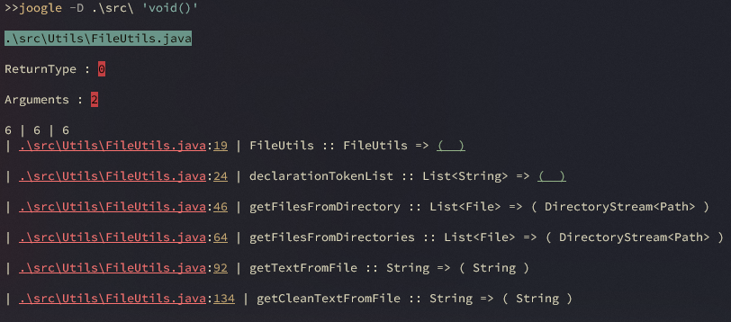

# Joogle
- CLI exploration app like [Coogle](https://www.youtube.com/watch?v=wK1HjnwDQng&t=1s) by Tsoding.
>- Parses the java file to find the methods and instance declarations.


-------

------

# Dependencies 
- [Java 17](https://www.oracle.com/es/java/technologies/downloads/#jdk17-windows)
- [java-build-tool](https://github.com/AlfonsoG-dev/javaBuild.git)

# Folder Structure
- the work space contains two folders where:
>- `src`: is to maintain the sources
>- `bin`: is to contain the `.class` files generated by the compile operation
>- if you want to change the folder structure remember to check if the powershell script is still working

# Features
- [x] search the sentence within a file.
- [x] search the sentence within a directory.
- [x] search the sentence within all directories of the given directory
- [x] output the code block of the given method
- [x] list all the files with the `.java` extensión
- [x] list all the methods in the given directory
- [x] list all the TODO in the current project
- [x] input type panel if you not give CLI option

-----

# Usage

- you can use the jar file to execute or create and executable
```shell
java -jar joogle.jar -search operation App.java "search sentence"
```
>- only the equal return type and arguments get the color green the most equal will be yellow

# Search definitions

- when searching a pattern for declarations or method names use the following sentences.

## Search in file
- when searching in files use:
```pwsh
java -jar joogle.jar -f App.java 'void(int)'
```
>- `java -jar joogle.jar`: this execute the `.jar` file.
>- `-f App.java`: indicates the file where the sentence is within.
>- `'void(int)'`: indicates the return type and the arguments of the method to search.

## Search in directory
- when searching within a directory use:
```pwsh
java -jar joogle.jar -d .\test\ 'void(int)'
```
>- `-d .\test\`: indicates to search the sentence inside all of the `.java` files in the given directory.
>>- only the files of the directory are used, if the directory have a nested structure the other directories are not taken into account. 

## Search in directories

- when the given directory have a nested structure use:
```pwsh
java -jar joogle.jar -D .\test\ 'void(int)'
```
>- `-D .\test\`: indicates to search the sentence inside of all the `.java` files in all the routes of the given directory.
>>- summary if the directory contains more directories they are taken into account

## Search for files

- search for the project files
- when searching for a file within a directory use:
```pwsh
java -jar joogle.jar -lf .\test\
```
>- `-lf .\src\`: this will list all of the files inside the project

## Search for method and its context

- when you want to know the content of a method use:
```pwsh
java -jar joogle.jar -lm .\test\ 'MethodName'
```
>- `-lm .\test\ 'MethodName'`: this will search for the given method inside all of the given directory.
>>- it acts like the `cat` command but for java methods.

## Search for TODO sentences

- when searching for TODO sentences use:
```pwsh
java -jar joogle.jar -lt .\test\
```
>- `-lt .\test\`: this will list all the TODO sentences in the directory or file.

>_ if you declare a TODO sentence using: `/**` or `/*`
```java
/**
 * TODO: used to declare a todo and additional info is aggregated with the following sentences
 * this is part of the todo and its call body.
 * it can aggregate lines until the term '*/'
 */
```
>_ if you declare a TODO sentence using: `//`
```java
// TODO: this is a one line only TODO sentence.
// unlike the previous one, this isn't part of the TODO sentence.
```

---------

# Compile And Execute

- this project uses: [java-build-tool](https://github.com/AlfonsoG-dev/javaBuild.git).
>- Also in the root of the project, you can find a build shell script to compile and create the jar file.
```pwsh
pwsh -Command java-exe.ps1
```

---------

# Disclaimer
- this project is for educational purposes.
- is not intended to create a full program.
- security issues are not taken into account.
- It only works on WINDOWS OS.
