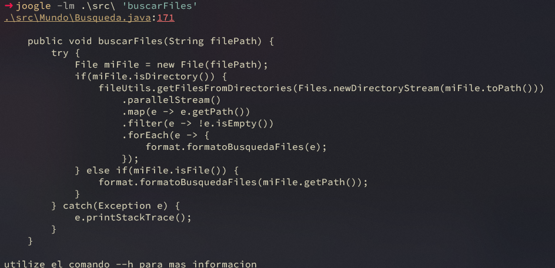

# Joogle
>- CLI exploration app like [Coogle](https://www.youtube.com/watch?v=wK1HjnwDQng&t=1s) by Tsoding
>- Parses the java file to find the methods anl instance declarations


-------

------

## Dependencies 
>- [Java 17](https://www.oracle.com/es/java/technologies/downloads/#jdk17-windows)

## Folder Structure
>- thw workspace contains two folders where:
>>- `src`: is to maintain the sources
>>- `bin`: is to contain the `.class` files generated by the compile operation
>- if you want to change the folder structure remember to check if the powershell script is strill working

## Features
- [x] search the sentence within a file.
- [x] search the sentence within a directory.
- [x] search the sentence within all directories of the given directory
- [x] output the code block of the given method
- [x] list all the files with the `.java` extensión
- [x] list all the méthods in the given directory
- [x] list all the TODO in the current proyect
- [x] input type panel if you not give CLI option

-----

## Usage
>- search the sentence within a file
```shell
java -jar joogle.jar -f App.java "void => ()"
```

## Search definitions

### Search in file
>>- `java -jar joogle.jar`: this execute the `.jar` file
>>- `-f App.java`: this indicates the file to search the sentence
>>- `"void => ()"`: this indicates the sentence to search within the file

### Search in directory
>- search the sentence in the given directory
>>- `-d .\src\`: this indicates to search the sentence inside of all the `.java` files in the given directory
>>>- if the directory contains more directories they are not taken into account

### Search in directories

>- search the sentence in all of the directories of the given directory
>>- `-D .\src\`: this indicates to search the sentence inside of all the `.java` files in all the routes of the given directory 
>>>- summary if the directory contains more directories they are taken into account

### Search for files

>- search for the proyect files
>>- `-lf .\src\`: this will list all of the files inside the proyect

### Search for method and its context

>- search for the method of the given directory
>>- `-lm .\src\`: this will list all of the methods inside the directory

>- search for the method context
>>- `-lm .\src\ "methodName"`: this acts like the `cat` commnad but for methods

### Search for TODO's

>- search for the TODO's sentences:
>>- `-lt .\src\`: this will list all the TODO's in the directory or file

------
### Aditional take
>- if you combine the CLI options in the current state of the proyect you cant do it.
```shell
java -jar joogle.jar -f app.java -f other.java ""
```
>>- it will output the result of the first option

>- if you want aditional information in the CLI
>>- this will output the each one of the CLI options
```shell
java -jar joogle.jar --h
```

---------

## Compile And Execute

>- if you are not using an IDE and need to compila the proyect with the *"javac"* CLI tool
>>- in the root of the proyect, you can find: `java-exe.ps1` shell script to compile and create the jar file

```shell
#class to compile
$Clases = " ./src/*.java"
#compile program and save the .class data in bin
$Compile = "javac -d ./bin" + "$Clases"
#just for testing purposes
$JavaCommand = "java -cp ./bin ./src/App.java -f ./src/App.java " + '""'
#execute the commands
$RunCommand = "$Compile" + " && " + "$JavaCommand"

Invoke-Expression $RunCommand
```
>- if you need to create the `.jar` file
>>- first you need to create the `Manifesto.txt` file with the `Main-class: App` sentence
```txt
Main-class: App
```
>>- and modify the script with the next command
```shell

#create jar file
$CreateJarFile = "jar -cfm joogle.jar Manifesto.txt -C bin ."
#execute the commands
$RunCommand = "$Compile" + " && " + "$JavaCommand" + " && " + "$CreateJarFile"

Invoke-Expression $RunCommand
```

---------

## Disclaimer
>- this proyect is for educational purposes
>- is not intendes to create a full program
>- security issues are not taken into account
